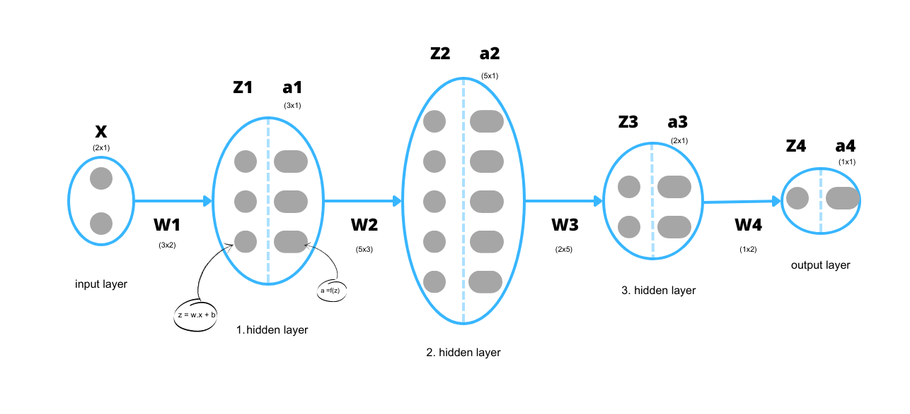

# My_neural_network
Neural Network from scratch in Python

If we call:

- Output: $Y$
- Input: $X$
- Weight: $W$
- Bias: $B$
- Activation function: $f(z = W\cdot X + B)$
- Cost function: $C$

## Forward Propagation
In forward propagation, for each layer:

$X  \rightarrow \boxed{\text{layer}} \rightarrow  Y$

$Y = f(z = W\cdot X + B)$

The output for one layer is the input for the next layer.

**At the end of the forward propagation, we can calculate the error as the derivative of the cost function with respect to the output for the neural network model output. We will call it the output gradient $\frac{\partial C}{\partial Y}$ .** 

## Backward Propagation
In backward propagation, for each layer:

$\frac{\partial C}{\partial X} \leftarrow \boxed{\text{layer}} \leftarrow \frac{\partial C}{\partial Y}$

$\frac{\partial C}{\partial z} = f'(z) \odot \frac{\partial C}{\partial Y}$

$\frac{\partial C}{\partial w} = \frac{\partial C}{\partial z} \cdot X^T$

$\frac{\partial C}{\partial B} = \frac{\partial C}{\partial Y}$

$\frac{\partial C}{\partial X} = w^T \cdot \frac{\partial C}{\partial z} \quad$ (the new output gradient for the previous layer)

 

## For example:

If we have 2x1 input and 3 hidden layers, here is how to do the forward and backward propagation for the output layer and the rest layers will be the same:

1. Forward pass:
$z^{(4)} = w^{(4)} \cdot a^{(3)} + b^{(4)}$

$a^{(4)} = f(z^{(4)})$

2. The derivative of the cost function (output gradient) $\frac{\partial C}{\partial a^{(4)}}$.

3. Backward pass:
$\frac{\partial C}{\partial z^{(4)}} = \frac{\partial a^{(4)}}{\partial z^{(4)}} \cdot \frac{\partial C}{\partial a^{(4)}}$

$\frac{\partial C}{\partial w^{(4)}} = \frac{\partial z^{(4)}}{\partial w^{(4)}} \cdot \frac{\partial C}{\partial z^{(4)}} = \frac{\partial C}{\partial z^{(4)}} \cdot (a^{(3)})^{T}$

$\frac{\partial C}{\partial a^{(3)}} = \frac{\partial z^{(4)}}{\partial a^{(3)}} \cdot \frac{\partial C}{\partial z^{(4)}} = (w^{(4)})^{T} \cdot \frac{\partial C}{\partial z^{(4)}}$

For the 3rd hidden layer we will take the $\frac{\partial C}{\partial a^{(3)}}$ as the output gradient.
